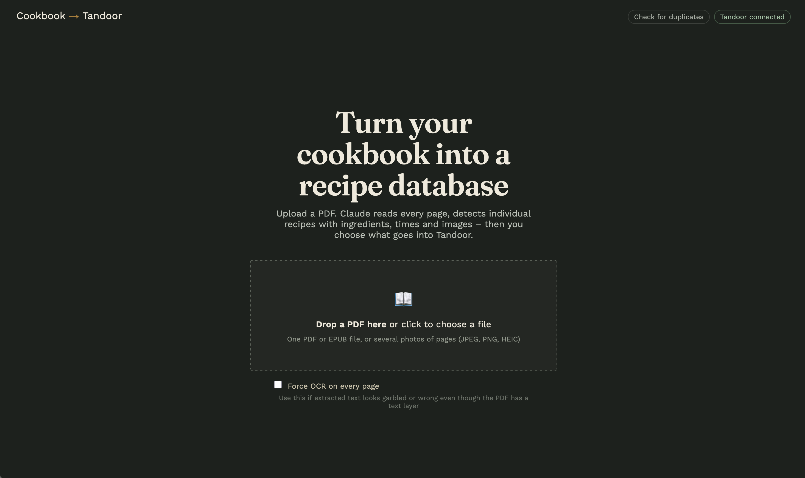
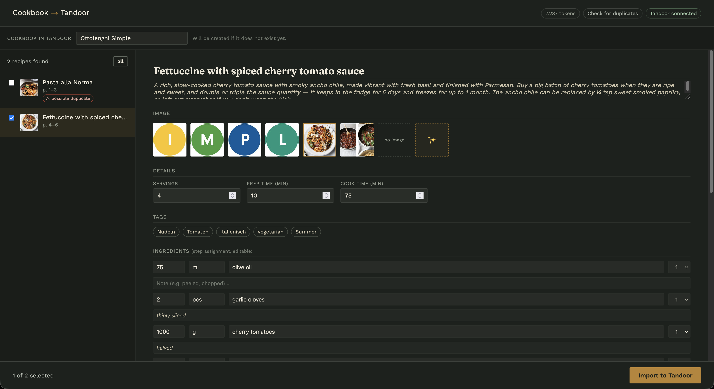
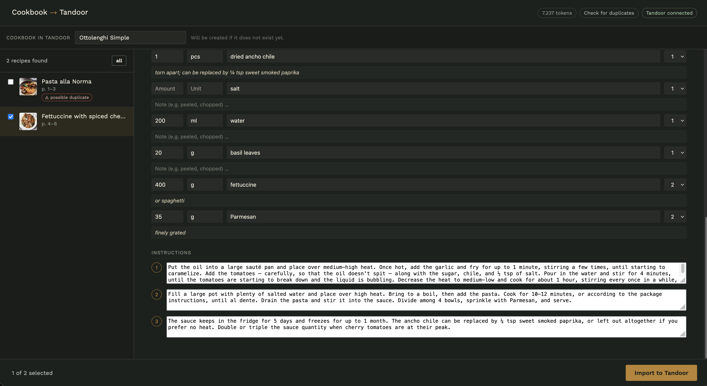
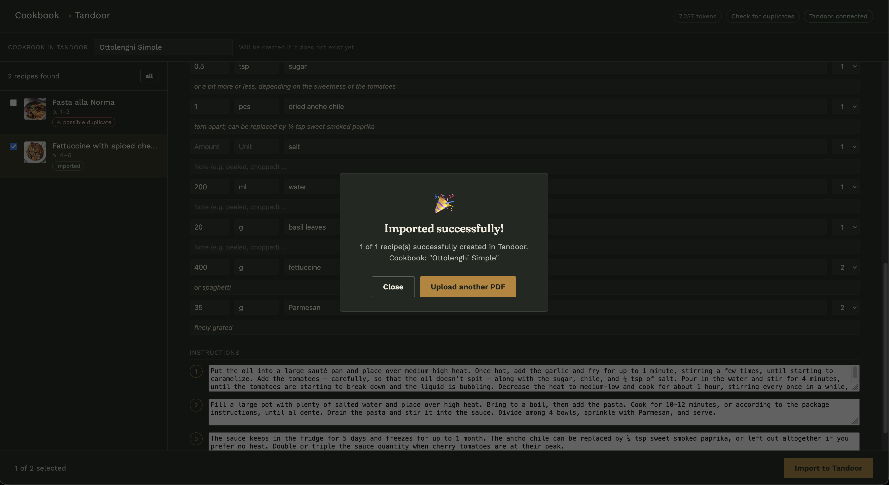

# Cookbook → Tandoor Importer

Turn a **PDF cookbook into a Tandoor recipe collection**.

Upload a cookbook and let an AI model automatically identify individual recipes, extract their ingredients and instructions, find recipe images, calculate metadata, and apply tags. Review and edit the results in a web interface, then import the recipes you want directly into [Tandoor](https://tandoor.dev/) via its API.

**Supported AI providers:** Claude · ChatGPT · Gemini

<p align="center">
  
</p>

<p align="center">
  
</p>

<p align="center">
  
</p>

<p align="center">
  
</p>

---

## ✨ Features

* 📖 **PDF cookbook import** — upload an entire cookbook at once
* 🤖 **AI-powered recipe extraction** — automatically identifies individual recipes
* 🖼️ **Recipe images** — extracts and associates images with recipes
* 🥕 **Ingredients & instructions** — structured into Tandoor-compatible recipes
* ⏱️ **Recipe metadata** — cooking time, preparation time, servings, etc.
* 🏷️ **Automatic tagging** — generate tags and optionally reuse existing Tandoor tags
* 🌍 **Language conversion** — output recipes in a language of your choice
* ⚖️ **Metric conversion** — automatically convert imperial measurements to metric
* 🔍 **Duplicate detection** — check existing Tandoor recipes before importing
* ✏️ **Review & edit** — inspect and modify extracted recipes before importing
* 🚀 **Bulk import** — select multiple recipes and import them into Tandoor
* 🔌 **Multiple AI providers** — choose Claude, ChatGPT, or Gemini
* 🐳 **Docker-based** — simple setup with Docker Compose

---

## 🚀 Setup

### Requirements

* Docker
* Docker Compose
* A running [Tandoor](https://tandoor.dev/) instance
* An API key for one of the supported AI providers

### 1. Create your environment file

```bash
cp .env.example .env
```

Edit `.env` and configure:

```env
AI_PROVIDER=anthropic

ANTHROPIC_API_KEY=your-api-key

TANDOOR_URL=http://your-tandoor-instance
TANDOOR_TOKEN=your-tandoor-token
```

See [Configuration](#configuration) for all available options.

### 2. Start the application

```bash
docker compose up --build -d
```

### 3. Open the web interface

Go to:

**http://localhost:8420**

The port can be changed in `docker-compose.yml`.

---

## 🔑 Tandoor API Token

The importer communicates with Tandoor through its API.

In Tandoor, create an API token under:

**User menu → Settings → API → Create new token**

Then add the token to `.env`:

```env
TANDOOR_TOKEN=your-token
```

`TANDOOR_URL` should contain the base URL of your Tandoor instance **without a trailing slash**:

```env
# Correct
TANDOOR_URL=http://192.168.1.100:8080

# Avoid
TANDOOR_URL=http://192.168.1.100:8080/
```

---

## ⚙️ Configuration

All configuration is handled through `.env`.

| Variable              | Default             | Description                                                   |
| --------------------- | ------------------- | ------------------------------------------------------------- |
| `AI_PROVIDER`         | `anthropic`         | AI provider: `anthropic`, `openai`, or `gemini`               |
| `ANTHROPIC_API_KEY`   | —                   | API key for Anthropic                                         |
| `CLAUDE_MODEL`        | `claude-sonnet-4-6` | Claude model to use                                           |
| `OPENAI_API_KEY`      | —                   | API key for OpenAI                                            |
| `OPENAI_MODEL`        | `gpt-4o`            | OpenAI model to use                                           |
| `GEMINI_API_KEY`      | —                   | API key for Google Gemini                                     |
| `GEMINI_MODEL`        | `gemini-2.5-flash`  | Gemini model to use                                           |
| `TANDOOR_URL`         | `recipes.homeserver.com`| URL of your Tandoor instance                                  |
| `TANDOOR_TOKEN`       | —                   | Tandoor API token                                             |
| `OUTPUT_LANGUAGE`     | `English`           | Language for extracted recipes **and the application's UI**   |
| `CONVERT_TO_METRIC`   | `true`              | Convert cups, oz, lb, °F, inches, etc. to metric units        |
| `CHECK_DUPLICATES`    | `true`              | Check recipe titles against existing Tandoor recipes          |
| `REUSE_EXISTING_TAGS` | `true`              | Prefer existing Tandoor tags when generating tags             |
| `CUSTOM_INSTRUCTIONS` | `tag cookie-recipes with "grandmas cookies" ` | Additional instructions appended to the extraction prompt     |
| `JOB_RETENTION_HOURS` | `48`                | How long completed jobs and their uploaded files are retained |
| `MAX_UPLOAD_MB`       | `100`               | Maximum PDF upload size                                       |

---

## 🤝 Contributing

Contributions, bug reports, and ideas are welcome.

If you find a problem or have an idea for improving the importer, please open an issue or submit a pull request.
